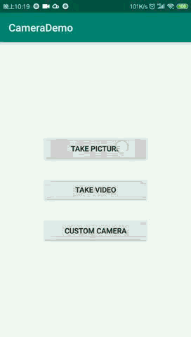
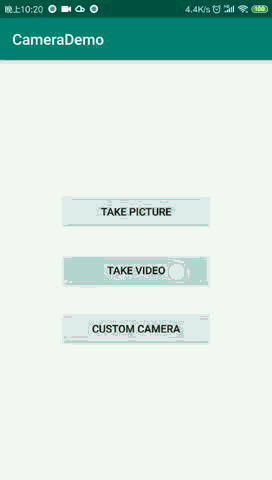

# Chapter7-camera
chapter7: classwork of ByteDance Android training in BIT 

## 作业完成情况记录

### 练习一 照片拍摄

任务：调用系统相机，实现拍照功能，并将照片存储在外部公共目录Pictures/CameraDemo下。

1. 动态申请权限，访申请相机、存储权限。主要代码逻辑如下：

```java
        findViewById(R.id.btn_picture).setOnClickListener(v -> {

            if (ContextCompat.checkSelfPermission(TakePictureActivity.this,
                    Manifest.permission.WRITE_EXTERNAL_STORAGE) != PackageManager.PERMISSION_GRANTED
                    || ContextCompat.checkSelfPermission(TakePictureActivity.this,
                    Manifest.permission.CAMERA) != PackageManager.PERMISSION_GRANTED) {
                //在这里申请相机、存储的权限
                ActivityCompat.requestPermissions(TakePictureActivity.this,
                        new String[]{Manifest.permission.CAMERA, Manifest.permission.WRITE_EXTERNAL_STORAGE},
                        REQUEST_PERMISSION_STORAGE_CAMERA);
            } else {
                takePicture();
            }
        });

    @Override
    public void onRequestPermissionsResult(int requestCode, @NonNull String[] permissions, @NonNull int[] grantResults) {
        switch (requestCode) {
            case REQUEST_PERMISSION_STORAGE_CAMERA: {
                //判断权限是否已经授予，通过Toast通知用户权限获取情况
                for (int i = 0; i < grantResults.length; i++) {
                    int state = grantResults[i];
                    if (state == PackageManager.PERMISSION_GRANTED) {
                        Toast.makeText(TakePictureActivity.this, permissions[i] + " permission granted",
                                Toast.LENGTH_SHORT).show();
                    } else if (state == PackageManager.PERMISSION_DENIED) {
                        Toast.makeText(TakePictureActivity.this, permissions[i] + " permission denied",
                                Toast.LENGTH_SHORT).show();
                        return;
                    }
                }
                takePicture();
                break;
            }

        }
    }

```

2. 直接拍摄返回的图片比较模糊，需要设置图片的输出路径，即图片存储到外部公共目录Pictures/CameraDemo,这一步需要已获取存储权限。主要利用了老师提供的`Utils`工具类方法`Utils.getOutputMediaFile(Utils.MEDIA_TYPE_IMAGE);`。


3. 图片旋转角度可能存在问题，需要通过代码校准图片方法的旋转角度，即通过老师提供的`Utils`工具类的方法`Utils.rotateImage(bmp, imageFile.getAbsolutePath())`。


4. 拓展：在相册中扫描到拍摄的照片。通过广播组件通知相册更新数据，显示所拍摄的照片。
```java
    // 发送广播通知相册更新数据,显示所拍摄的照片
    sendBroadcast(new Intent(Intent.ACTION_MEDIA_SCANNER_SCAN_FILE, Uri.fromFile(imageFile)));
```

**练习一演示效果如下所示：**

<p align="center">
    
    <p align="center">
        <em>练习一</em>
    </p>
</p>

### 练习二 视频录制

任务：录制一段自拍视频

1. 解决权限申请问题，申请存储和相机权限，如练习一中的代码一样申请权限。

2. 直接采用相机的默认视频存储，路径为外部公共目录/DCIM/Camera/

3. 相机拍摄后在页面上播放，使用VideoView控件播放视频。
```java
    @Override
    protected void onActivityResult(int requestCode, int resultCode, Intent intent) {
        if (requestCode == REQUEST_VIDEO_CAPTURE && resultCode == RESULT_OK) {
            //todo 播放刚才录制的视频
            Uri videoUri = intent.getData();
            videoView.setVideoURI(videoUri);
            videoView.start();
        }
    }
```

4. 点击暂停，再次点击恢复播放。 给VideoView添加点击事件监听器，监听点击事件，通过判断视频是否在播放，来暂停和继续播放视频。
```java
    videoView.setOnClickListener(v -> {
            if (videoView.isPlaying()) {
                videoView.pause();
            } else {
                videoView.start();
            }
        });
```

**练习二演示效果如下所示：**

<p align="center">
    
    <p align="center">
        <em>练习二</em>
    </p>
</p>

### 练习三 自定义录制

自定义录制一段视频

1. 解决权限申请问题，此处多加了一个麦克风权限，申请方式如练习一二所示。

2. 存储到SD卡，主要使用老师提供的`Utils`工具类方法。

3. 参考MediaRecorder状态机，去初始化和设置MediaRecorder。

4. 视频录制完成，在手机目录中预览视频。

5. 拓展：在相册中能扫描到该视频。如练习一中的步骤，通过广播组件通知相册更新数据。


**练习三演示效果如下所示：**

<p align="center">
    
    <p align="center">
        <em>练习三</em>
    </p>
</p>

在实现练习三的过程中，遇到了很多问题，主要是对拍照、视频的一些参数概念的理解有问题，还有对Camera、MediaRecorder和SurfaceView的一些API不是很熟悉。下面记录一些遇到的问题。

* 设置自动对焦，需要采用的对焦模式为`Camera.Parameters.FOCUS_MODE_CONTINUOUS_PICTURE`，持续对焦；`Camera.Parameters.FOCUS_MODE_FOCUS_MODE_AUTO`对焦模式只在调用`autoFocus`方法的时候才会触发自动对焦，所以在startPreview方法之前调用一下`autoFocus`会存在只对焦了一次的问题。
```java
public Camera getCamera(int position) {
        CAMERA_TYPE = position;
        releaseCameraAndPreview();
        Camera cam = Camera.open(position);
        //todo 摄像头添加属性，例是否自动对焦，设置旋转方向等
        cam.setDisplayOrientation(rotationDegree);

        Camera.Parameters params = cam.getParameters();
        List<String> focusModes = params.getSupportedFocusModes();
        Log.d(TAG, focusModes.toString());
        if (focusModes.contains(Camera.Parameters.FOCUS_MODE_CONTINUOUS_PICTURE)) {
            Log.d(TAG, "auto focus");
            params.setFocusMode(Camera.Parameters.FOCUS_MODE_CONTINUOUS_PICTURE);
        }

        cam.setParameters(params);

        return cam;
    }
```

* 设置相机的PreviewSize，为了防止预览的图像发生畸变，需要通过`getOptimalPreviewSize`方法计算OptimalPreviewSize。`getOptimalPreviewSize`方法需要传入预览的SurfaceView控件的宽高作为参数，在`onCreate`的方法中获取不到SurfaceView的宽高，所以需要放到`startPreview`方法调用之前做这一步处理。
```java
private void startPreview(SurfaceHolder holder) throws IOException {
        //开始预览
        // 调整SurfaceView的预览size
        Camera.Parameters params = mCamera.getParameters();
        List<Camera.Size> sizes = params.getSupportedPreviewSizes();
        Camera.Size optimalPreviewSize = getOptimalPreviewSize(sizes, mSurfaceView.getWidth(),
                mSurfaceView.getHeight());
        if (optimalPreviewSize != null) {
            params.setPreviewSize(optimalPreviewSize.width, optimalPreviewSize.height);
        }

        mCamera.setPreviewDisplay(holder);
        mCamera.startPreview();
        mCamera.cancelAutoFocus();
    }
```